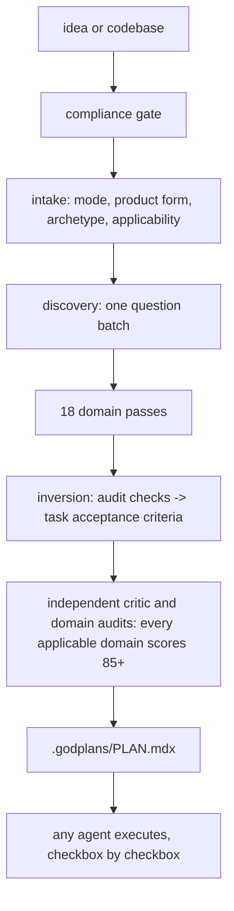

# godplans

[](https://github.com/hannsxpeter/godplans/actions/workflows/lint.yml)
[](CHANGELOG.md)
[](skills/godplans/SKILL.md)
[](#lineage)
[](skills/godplans/scripts/validate-plan.sh)
[](LICENSE)


### Plan everything before anything.

**One command turns your idea into a complete build plan that any AI coding agent can execute, checkbox by checkbox, without you re-explaining it every session.**

```
/godplans I want to build a shared expense tracker for roommates
```

You answer three to five questions. godplans writes the plan. Any coding agent builds it.

---

## Why this exists

Building software with AI is fast. Fixing software built on decisions nobody made is not.

Think of it like construction. An **audit** is the building inspection that happens after the walls are up. It is genuinely useful, and it is also the most expensive moment to learn that the foundation was wrong. The inspector does not hand you a fix. The inspector hands you a demolition estimate.

Today's AI tooling clusters at those two ends:

- **Planning tools** write specs and architecture diagrams before you start.
- **Auditors** scan finished code and report what slipped through: security holes, slow database queries, fragile AI integrations, pages search engines cannot find, screens people with disabilities cannot use, journeys that dead-end.

godplans closes the gap by moving the inspection to the blueprint. Every check an auditor would run at the end becomes a requirement in the plan at the start, attached to a specific task, with a specific way to prove it was done.

> An auditor that finds a missing tenant-isolation policy after three weeks of building has found a rewrite. A plan that requires that policy before the first database migration has prevented one.

A decision costs a sentence at plan time. It costs a sprint at remediation time.

## Who this is for

| You are | godplans gives you |
|---|---|
| A solo builder shipping fast with AI | Decisions you would otherwise discover the hard way, settled in minutes |
| A small engineering team | One document everyone and every agent reads, instead of five stale ones |
| A founder or product lead who does not code | A plain-language plan you can actually read, question, and approve before money is spent |
| Someone inheriting an existing codebase | A plan that studies what is already there and extends it, rather than fighting it |

It earns the most when an incomplete decision would be expensive to undo later: how customer data is separated, what your public API promises, who is allowed to see what, how the thing gets deployed and watched.

## Quickstart

```bash
# recommended: the skills package manager (installs for your tools)
npx skills add hannsxpeter/godplans

# or: clone and run the installer
git clone https://github.com/hannsxpeter/godplans
cd godplans && sh install.sh
```

Then, in your coding agent, in any project folder:

```
/godplans I want to build a shared expense tracker for roommates
```

That is the whole interface. There are no sub-commands to learn.

**What happens next, in order:**

1. **A safety check.** The idea is screened against the [Anthropic Usage Policy](https://www.anthropic.com/legal/aup) before any planning starts.
2. **One batch of questions.** Three to five of them, only about decisions that are painful to reverse. Every question ships with a recommended answer, so typing `defaults` is a complete response.
3. **Every decision gets made.** Not deferred to "we'll figure it out in the code."
4. **A critic grades the work.** An independent pass scores each area against its own rubric and sends anything under 85 out of 100 back to be redone.
5. **You get `.godplans/PLAN.mdx`.** One file. Yours to read, edit, and approve.

The installer refuses to overwrite or remove a folder it does not own. Use `--force` only when replacement is intentional.

## What a plan actually looks like

The plan is a plain markdown file with checkboxes. Here is one task from one:

```markdown
- [ ] GP-101 [W1.1] Add workspace scoping to the expenses table
  - Files: db/migrations/003_expenses_workspace.sql, src/db/expenses.ts
  - Depends on: GP-072
  - Reuses: the workspace helper already in src/db/tenancy.ts
  - Acceptance: every expenses query filters on workspace_id; row-level
    security enabled; no raw table access outside src/db/expenses.ts
  - Verify: `npm run test:tenancy`
  - Requirements: R-2.3, R-SEC-4
```

Read that as a non-engineer and you can still tell what is being built, what it depends on, what "done" means, and how "done" gets proven. That is the point. A checked box that nobody can verify is a promise, not progress.

A full plan contains:

- **The objective**, with an observable definition of done, plus what is explicitly *not* in scope.
- **The decisions**, hardest-to-reverse first, each with why it was chosen, what was rejected, and the signal that would tell you it was wrong.
- **The requirements**, numbered and written as testable sentences.
- **The architecture**, as diagrams placed next to the claims they support, with real capacity numbers rather than the word "scalable."
- **The phases and tasks**, like the one above, grouped into waves that can safely run at the same time.
- **The unknowns**, in exactly one place, each with an owner, what it blocks, and the default that fires if nobody answers.
- **A validator script**, copied in beside the plan, that mechanically checks the plan keeps its own promises.

<details>
<summary><b>The complete contents, in technical detail</b></summary>

One canonical plan document, `.godplans/PLAN.mdx`, containing:

- An objective with an observable definition of done, scope, and named non-goals.
- The compliance gate result and the applicability matrix (every domain planned now, deferred with an observable trigger and reversibility argument, or excluded with the evidence state that licensed the exclusion and the `revisit when` predicate that reverses it), plus the module disposition naming which layer dropped every requirement that did not land.
- A primary product form selected before archetype, with form-specific vertical slices and completion evidence for web, API or service, CLI or SDK, mobile or desktop, data or ML, and infrastructure or IaC work.
- A scored archetype rather than a guessed one: weighted signals with vetoes produce a primary and a runner-up, and the plan records both scores, the margin, and what changes if the runner-up is right, priced in tasks and phases. The confidence label is recomputed by the validator from those numbers, so a confident label that does not follow from the plan's own arithmetic fails. Below the 0.45 floor the archetype is `unknown`, goes to Open Questions, and withholds every `assure`-stage document from being marked not-applicable, because a misread archetype deletes threat models quietly. The archetype drives the applicability matrix and, through it, the documentation set, so getting it wrong mis-selects two artifacts at once.
- Overlays (`ai-system`, `public-ui`, `shipped-artifact`, `operated-by-others`, `regulated-data`, `agent-skill-package`) alongside the archetype. An archetype says what a project is; an overlay says what extra obligations it carries. Overlays raise and never lower: a domain an overlay covers may be applicable or deferred, never excluded. Modelling AI or regulated data as archetypes would force a false choice at the top of the tree and produce the wrong set for exactly the project that is both.
- Plan provenance bound to source revision, a SHA-256 input digest, and a UTC validation timestamp, with stale completed or imported evidence returning the plan to `planning`.
- Decisions, hard-to-reverse bets first, each with rationale, rejected alternatives, an observable signal, a failure boundary, and a return-to-planning action; assumptions flagged as hypotheses with validation tasks and priced in tasks and phases, so taking the defaults is an informed choice.
- Numbered requirements with EARS acceptance criteria (WHEN ... THE SYSTEM SHALL ...).
- Architecture as mermaid diagrams (components with trust boundaries, data model, load-bearing flows) placed next to the claims they support, plus a capacity model that stops the numbers from floating: each availability target gets a redundancy topology and a named health-check rule, each entity group gets a read-consistency stance and single-node ceiling arithmetic that either names a partition key or shows one node holds, each cached read path gets a staleness budget and stampede protection, and each entry surface gets a stated behavior above its throughput ceiling instead of defaulting to unbounded queueing.
- A style genome so the first commit already matches the intended code DNA, measured rather than eyeballed in brownfield mode, and the agent-memory files (AGENTS.md, pillars) the scaffold will emit.
- A documentation set: which documents this project owes, keyed to lifecycle stage with a single owning module and the task that writes each one, and which it does not owe, each absence carrying the evidence behind it and the predicate that would reverse it. An unexamined absence reads exactly like a considered decision, which is the row an auditor pulls first.
- Phases and waves of checkbox tasks. Every task: a stable GP-number, exact files, dependencies, what it reuses, grep-verifiable acceptance criteria, one verify command whose exit code proves it, and requirement traceability.
- Goal-backward must-haves per phase, an executable phase checkpoint, a mandatory final verification phase, embedded rules for executing agents, and a session log.
- Exactly one Open Questions section, holding only the residual unknowns the plan can execute past. Each carries an owner, what it blocks, when the default fires, and the recommended default. An unknown that dependent work cannot start without is not a question: it is a flagged hypothesis whose validation task is scheduled ahead of everything that assumes it.
- A generated `.godplans/PLAN.json` sidecar carrying decisions, applicability with its tripwires, the module disposition, the documentation set, phases, active and superseded tasks, dependencies, requirements, parallel-safety, and plan half-life metrics for tools that should not parse MDX.

The skill also emits `.godplans/validate-plan.sh`, a self-contained companion that validates lifecycle state, provenance formats, product form, conditional public-release gates, counters, phase and task grammar, ordered dependency and requirement references, deferral constraints, exclusion evidence states and tripwires, module disposition grammar, documentation-set rows, falsifier blocks, executable checkpoints, banned characters, and final-phase structure. It also holds the plan to its own internal promises: the three frontmatter domain lists must say what the applicability matrix says, a task marked parallel-safe must touch files no other unchecked task in its wave touches, and a requirement the plan says it dropped may not still appear on a task. A marker an executor acts on is checked, not trusted. Its explicit drift mode recomputes marked provenance files, reruns a deterministic sample of completed Verify commands, and reproves the phase checkpoint. The plan remains the only source of product and execution truth; PLAN.json is generated atomically from it.

</details>

## The plan is the handoff

This is the part that changes how work feels.

The plan is not a document you write and then abandon while the real work happens in a chat window. It *is* the working memory. Any coding agent, the same one or a completely different tool next month, picks it up and continues checkbox by checkbox. Close your laptop mid-build, come back in three weeks, switch from one AI tool to another: work resumes by re-reading the file, not by re-reading the conversation.

Plans survive tool switches. Chat context does not.

## How it works



The eighteen domain passes cover what to build and for whom, how the parts fit together, in what order, on what technology, how the repository is set up, and how the result deploys, gets monitored, launches, and gets hardened, plus the audit dimensions: code quality, security, database, AI integration, search visibility, UI, and UX.

## Approval and execution

A plan has a lifecycle, and it is enforced rather than suggested: `planning -> approved -> executing -> done`.

A new or materially changed plan stays in `planning` until you explicitly approve it. Agents refuse to start building from an unapproved plan. Only a passing final verification phase can mark it `done`. Nothing marks itself complete.

```bash
# validate a draft before approval
bash .godplans/validate-plan.sh --allow-planning .godplans/PLAN.mdx

# validate the execution gate after approval
bash .godplans/validate-plan.sh .godplans/PLAN.mdx

# reprove a completed phase before the next phase starts
bash .godplans/validate-plan.sh --drift-check 1 .godplans/PLAN.mdx
```

## Does it actually work?

Here is the honest version, including the part that is not flattering.

**The first published head-to-head test.** The same builder agent, with no planning skill of its own, built the same multi-tenant notes API twice: once from a godplans plan, once from the plain request. Both passed the same functional tests. Then an independent auditor scored both repositories without being told which was which.

| | Critical findings | High findings |
|---|---|---|
| Built from a godplans plan | 0 | 1 |
| Built without one | 1 | 4 |

**The cost was real too.** Planning consumed 11,236,025 cumulative tokens reported by the CLI (including cached input) against 162,816 for the control. Planning this thoroughly is not free.

That is one case on one model. It is directional support for the claim, not proof of a universal guarantee. The [method, limitations, and raw artifacts](evals/outcomes/results/2026-07-23-tenant-notes-api-codex/README.md) are published in full.

<details>
<summary><b>How the evidence is produced, and what still falls short</b></summary>

Repository tests cover installer collisions and aliases, portable-prompt parity, plan-validator failure modes, JSON and shell validity, version parity, immutable action pins, and the behavioral evaluation harness. The behavioral matrix also covers product-form routing, Pillars 1.1 nested scopes and catalogs, stale source evidence, stale prepublication evidence, and observability evidence labels.

```bash
npm test
npm run lint

# release-grade validation with the pinned official Agent Skills validator
python3 -m venv .venv-skills-ref
.venv-skills-ref/bin/pip install -r requirements/skills-ref.txt
SKILLS_REF_BIN="$PWD/.venv-skills-ref/bin/skills-ref" npm run release:check

# optional maintainer benchmark using already authenticated host CLIs
npm run eval:matrix

# rescore retained outputs after expectation changes
bash scripts/eval.sh --score-only
```

Conformance is not value. Passing the matrix proves the skill did what it
promised; it does not prove the promise was worth loading. The control arm
answers that: `scripts/eval.sh --baseline` runs each case a second time through
the same agent and model with no skill loaded, on a neutral request, and
reports the delta. The included Codex runners isolate `HOME` and `CODEX_HOME`.
The Claude runners use safe mode while retaining normal host authentication.
The Gemini runners use workspace-scoped skill and hook controls. Every runner
records its isolation mode, and the control reads a de-branded
`REQUEST.baseline.md` so it is never told to use a skill it does not have.

Using godplans never requires provider credentials. The optional repository
benchmarks invoke host CLIs through the runner contract and reuse whatever
authentication those tools already have.

```bash
GODPLANS_EVAL_RUNNER="$PWD/evals/runners/codex.sh" \
GODPLANS_EVAL_BASELINE_RUNNER="$PWD/evals/runners/codex-baseline.sh" \
bash scripts/eval.sh --baseline
```

The historical 1.8.0 baseline under `evals/baselines/` covers one model and
three cases. It is retained as provenance, but it no longer meets the evidence
minimum. Publishable release evidence now means all ten cases across Codex,
Claude, and Gemini, both arms, with raw artifacts and actual token usage. The
blind external grader adds at least two no-skill judges over five or more plan
pairs and reports the inter-rater gap. The build-outcome evaluation gives
matched plans to the same no-skill builder, hides arm identity, runs godaudits
on both built repositories, and compares open Critical and High findings. A tie
or loss is published with equal prominence.

</details>

## Three ways to start

- **Greenfield.** A brand new idea. The full arc from one sentence to a finished plan.
- **Brownfield.** An existing codebase. godplans reads what is already there first (the stack, the structure, the coding style, the conventions) and writes a plan that extends it and cites real files. A claim that something is *missing* has to carry the command that came back empty, because you cannot prove an absence by pointing at a file. If a recent `.godaudits/EVIDENCE.json` exists for the same revision, it is reused and cited rather than re-derived; a stale one is refused, because a stale one looks exactly like a fresh one. godplans neither requires nor calls godaudits.
- **Replan.** A plan already exists and reality moved. State is re-derived from disk, completed work is never rewritten, new work gets new IDs, and superseded tasks are struck through with the reason they died.

## Works with your tools

The canonical skill is written in the Agent Skills format, and the installer exploits shared paths so six destinations cover every client below.

| Tool | Install path | Invoke |
|---|---|---|
| Claude Code | `~/.claude/skills/godplans` | `/godplans` |
| Codex CLI | `~/.agents/skills/godplans` | `$godplans` |
| Cursor | reads `.agents` and `.claude` paths | `/godplans` |
| VS Code / Copilot | reads `.claude` and `.agents` paths; project `.github/skills` | `/godplans` |
| Zed | `~/.agents/skills/godplans` | `/godplans` |
| OpenCode | reads `.claude` and `.agents` paths | auto |
| Windsurf | reads compat paths; native `~/.codeium/windsurf/skills` | `@godplans` |
| Gemini CLI | `~/.agents/skills/godplans` (or `gemini skills install <git-url>`) | auto |
| Amp | reads `.agents` and `.claude` paths | auto |
| Factory Droid | `~/.factory/skills/godplans` | `/godplans` |
| Cline | `~/.cline/skills/godplans` | auto |
| T3 Chat | no skill support: paste [PROMPT.md](PROMPT.md), then attach applicable lazy modules from `skills/godplans/references/` | manual |
| Aider | `aider --read PROMPT.md` | manual |
| Any chat UI | paste [PROMPT.md](PROMPT.md) as the system prompt | manual |

No skill support in your tool? Paste [PROMPT.md](PROMPT.md) into any chat window and you have most of it.

`PROMPT.md` is the generated slim core: discovery, plan format, product, architecture, stack, database, security, exemplar, template, validator, and plan half-life script. Remaining domains stay lazy as individual files under `skills/godplans/references/` and are attached only when applicable. Generate the historical all-in-one form for a one-off surface with `bash scripts/build-prompt.sh --full --output PROMPT.full.md`.

`evals/metrics/context-cost.json` records byte counts and an explicitly labeled token estimate for the native skill entry, portable core, generated full prompt, and every lazy module. Real evaluation runners record actual tokens per plan.

## Built to keep your account clean

godplans screens every project against the [Anthropic Usage Policy](https://www.anthropic.com/legal/aup) before it plans anything:

- **Prohibited purposes are refused** with the policy category named: fake engagement, phishing, scraping that evades safeguards, undisclosed AI passing as human.
- **Legitimate projects with risky parts get mandatory guardrail tasks**: AI disclosure, respecting robots.txt, rate limiting, professional review in high-stakes consumer areas like health, law, and finance.
- **It never coaches a model past a refusal**, and never suggests reusing personal subscription credentials for automated work. Anything scheduled to run unattended specifies a proper service account or cloud authentication flow.
- **The same screening runs in non-Claude tools.** Every provider has an equivalent policy.

Details in [references/compliance.md](skills/godplans/references/compliance.md).

## Lineage

godplans consolidates and inverts fifteen skills into one command. "Inverts" is the operative word: checks those tools run *after* the build became requirements godplans writes *before* it.

| Source | What carries over |
|---|---|
| [arc-ready](https://github.com/hannsxpeter/arc-ready) / [ready-suite](https://github.com/hannsxpeter/ready-suite) | The tier disciplines: PRD, architecture, roadmap, stack, repo, build, deploy, observe, launch, harden; the decision-hypothesis-question rule; the substitution test |
| [codeauditor](https://github.com/hannsxpeter/codeauditor) | 9 code-quality lenses, inverted into plan requirements |
| [secauditor](https://github.com/hannsxpeter/secauditor) | 11 OWASP/CWE-grounded dimensions, inverted; paper-control refusals |
| [dbauditor](https://github.com/hannsxpeter/dbauditor) | Schema, indexing, transactions, migrations, data protection, planned upfront |
| [llmauditor](https://github.com/hannsxpeter/llmauditor) | 12 LLM-integration dimensions: prompts, routing, cost, evals, guardrails |
| [seoauditor](https://github.com/hannsxpeter/seoauditor) | Search and AI-answer-engine visibility decided at architecture time |
| [uiauditor](https://github.com/hannsxpeter/uiauditor) | Accessibility, semantics, design-system consistency as acceptance criteria |
| [uxauditor](https://github.com/hannsxpeter/uxauditor) | Journeys, workflows, error states designed before build |
| [pillars](https://github.com/hannsxpeter/pillars) | Pillars 1.1 agent memory: nested scopes, local absent catalogs, deterministic routing, and context budgets |
| [codedna](https://github.com/hannsxpeter/codedna) | The style genome: prescribed for greenfield, fingerprinted for brownfield. The AI-tells catalog and the measurement script ship with godplans, vendored by copy |
| [docdna](https://github.com/hannsxpeter/docdna) | The documentation selection engine, inverted to plan time: which documents this project owes, which it does not and on what evidence, and the tripwire that reverses each absence. Also the three-valued evidence model, the durability split, and the rule that no number is invented |
| [BuilderIO visual-plan](https://github.com/BuilderIO/skills) | Plan discipline: hard-to-reverse bets first, reuse-first steps, one Open Questions section, the standalone-plan rule, the visual layer |
| [wayfinder](https://github.com/mattpocock/skills/blob/main/skills/engineering/wayfinder/SKILL.md) (MIT, Matt Pocock) | Two ideas, re-expressed for a single-file plan: a fact lives in exactly one place (the frontmatter domain lists are now checked against the applicability matrix that decides them), and the set of work safe to take next is proved rather than asserted (`[P]` parallel-safety is now enforced, not promised). Also the refer-by-name presentation rule. No text, prompt, or code copied; godplans takes none of its issue-tracker map, ticket types, fog-of-war section, or one-ticket-per-session protocol |
| [ADHD](https://github.com/UditAkhourii/adhd) (MIT, Udit Akhouri) | Two ideas, re-expressed for planning: the critic must not be the author (Phase 6), and a menu of options is not a set of alternatives (R-STACK-21, the R-ARCH-4 open set, the Open Questions off-framing rule). No text, prompt, or code copied; godplans takes none of its novelty scoring, frame library, or runtime |

## FAQ

**I am not an engineer. Can I use this?**
You can read the output, question it, and approve it, which is the part that matters most. Running the command requires an AI coding tool such as Claude Code, Cursor, or Copilot, and the plan lands as a file in a project folder. If someone on your team can get you that far, the plan itself is written to be argued with in plain language.

**Does godplans build the project?**
No. It plans. The plan carries its own instructions for the agent that builds it, so any coding tool can execute it. That separation is deliberate: plans survive tool switches, chat context does not.

**Does "audit-aware" mean guaranteed audit-clean?**
No. Moving known checks into requirements reduces preventable findings. It cannot prove how code behaves at runtime, and it does not replace tests, security review, or an independent audit. Execution quality, changing dependencies, and genuinely new risks are still real.

**What if my project does not need a database, or search visibility, or a launch?**
Then it does not get a hollow section about one. Every area is either planned now, deferred behind a specific trigger that says when to revisit, or excluded with a stated reason and the condition that would reverse the exclusion. A command-line tool excludes search visibility; an internal tool can defer launch planning until it goes public.

**Why MDX and not plain markdown?**
The plan drops straight into documentation pipelines (Docusaurus, Nextra, Fumadocs) and MDX-native plan viewers, but the body is written to be plain GitHub-flavored markdown at the same time. Rename it to `PLAN.md` any time for rich rendering on GitHub. Nothing is lost.

**How is this different from arc-ready?**
arc-ready walks the arc one tier at a time, building as it goes. godplans front-loads every decision from all tiers plus all seven auditors into one document before anything is built. They compose: plan with godplans, execute with anything, including arc-ready's build tiers.

<details>
<summary><b>Repository map</b></summary>

| Path | Role |
|---|---|
| `skills/godplans/SKILL.md` | The orchestrator: ground rules, the 8-phase method, modes, refusals |
| `skills/godplans/references/` | 23 modules: 18 domain playbooks plus the plan-format, discovery, compliance, exemplar, and doc-set contracts |
| `skills/godplans/templates/PLAN.template.mdx` | The plan skeleton |
| `skills/godplans/scripts/validate-plan.sh` | Self-contained PLAN.mdx validator copied beside every plan |
| `skills/godplans/scripts/plan-halflife.sh` | Cumulative and per-domain task supersession metric generator |
| `skills/godplans/scripts/style-stats.py` | Measured style baseline for the style-genome pass, vendored by copy from codedna |
| `skills/godplans/schemas/PLAN.schema.json` | JSON Schema for generated PLAN.json sidecars |
| `.agents/skills/`, `.claude/skills/` | Symlink projections of the canonical skill |
| `install.sh` | Ownership-safe installer; `--project`, `--tools`, `--copy`, `--uninstall`, `--force` |
| `PROMPT.md` | Generated portable fallback |
| `scripts/lint.sh` | Meta-linter: unicode cleanliness, version parity, module contracts, PROMPT freshness |
| `scripts/release-check.sh` | Release-grade checks: pinned official validator, full suite, eval contract, tag/release parity, package dry run |
| `requirements/skills-ref.txt` | Pinned official Agent Skills validator dependency |
| `evals/` | Behavioral, external-grade, context-cost, and build-outcome evaluation contracts |
| `tests/` | Regression suite for product contracts |
| `docs/ABOUT.md` | The long-form writeup: why godplans exists and how it was designed |

</details>

## Read more

- [docs/ABOUT.md](docs/ABOUT.md) walks through why godplans exists and every design decision behind it.
- [CHANGELOG.md](CHANGELOG.md) records what changed and why.
- [CONTRIBUTING.md](CONTRIBUTING.md) covers the mechanically enforced style rules before you open a PR.

## License

[MIT](LICENSE). Contributions welcome.
