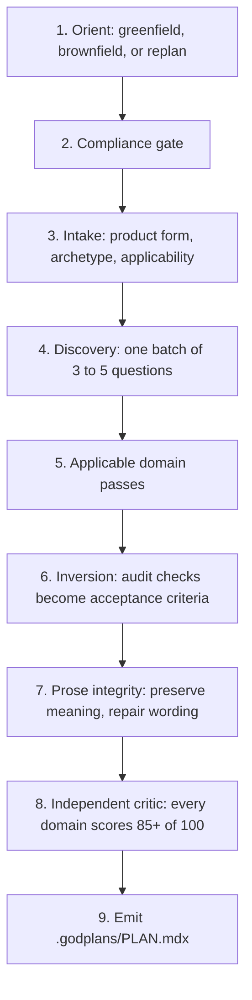

# About godplans

The long-form writeup: what godplans is, why it exists, and every design decision behind it.

New here? The [README](../README.md) is the short version. This page is for people who want to know *why* it works the way it does, including the parts that were wrong before and got fixed.

## The one-paragraph version

godplans turns an idea into a single, complete, machine-checkable build plan before any code is written. It does this by taking the checks that seven different code auditors run *after* a project is finished, and rewriting each one as a requirement the plan has to satisfy *before* the project starts. The output is one markdown file with checkboxes that any AI coding agent can execute, and a validator script that proves the plan keeps its own promises.

## The problem: remediation is the most expensive way to learn requirements

The AI coding ecosystem grew two families of tooling that rarely talk to each other.

**Arc tools** (PRD writers, architecture designers, roadmap sequencers, scaffolders) decide things before and during the build. **Auditors** (code quality, security, database, AI integration, search visibility, UI, UX) score things after the build and hand back a prioritized list of what is wrong.

Here is the uncomfortable thing about that second report: it is always partly a bill for decisions nobody made.

| Found at audit time | The same thing at plan time |
|---|---|
| A missing tenant-isolation policy, three weeks in | One requirement, written before the first migration |
| An inaccessible component library, after every screen is built | One acceptance criterion on every UI task |
| Database queries that fall over at real load | A capacity model with actual arithmetic in it |
| A public API you now cannot change without breaking customers | A decision, with the alternatives that were rejected |

The left column is a rewrite. The right column is a sentence.

Almost everything in an audit report was knowable at plan time. Nobody had collected it there. godplans is that collection, done once, mechanically.

It descends from twelve sibling repositories (arc-ready and ready-suite for the arc tiers; codeauditor, secauditor, dbauditor, llmauditor, seoauditor, uiauditor, uxauditor for the audit dimensions; pillars for agent memory; codedna for the style genome; docdna for the documentation set) plus the plan discipline of BuilderIO's visual-plan skill, two single-source ideas from Matt Pocock's wayfinder skill, two from Udit Akhouri's ADHD skill, and the meaning-preserving editorial pass from Lauren Tan's pstack unslop skill. Every audit check in the sibling skills was read, inverted into a plan-time requirement, and filed into the domain module that now enforces it. The seven auditors alone contributed several hundred concrete checks; those became the acceptance criteria a godplans plan distributes onto tasks. The unslop concepts are re-expressed for executable plans; no source text or catalog is copied.

The result is an audit-aware plan: checks that can be anticipated become acceptance criteria before implementation starts. That prevents avoidable findings. It does not claim that planning can prove runtime behavior or eliminate the need for an independent audit. Nothing can.

## The shape: one command, one canonical plan

godplans has no sub-commands. One invocation runs a nine-stage method:

The canonical human output is `.godplans/PLAN.mdx`. It is not a directory of competing specs and it is not a wiki. It is the one product and execution document an agent re-reads every session.

Its body is GFM-safe MDX (plain GitHub-flavored markdown that also parses as MDX), so it works in documentation pipelines and renders on GitHub after a rename to `.md`, with checkbox tasks, mermaid diagrams, and YAML frontmatter carrying machine state. The skill also generates `.godplans/PLAN.json` from the MDX, so executing tools can consume typed decisions, requirements, dependencies, active tasks, superseded tasks, and plan half-life metrics without parsing checkboxes. A self-contained `.godplans/validate-plan.sh` companion carries no decisions of its own; it proves the plan contract and lifecycle state.

The plan is executable in a specific, testable sense. Every task carries exact file paths, dependency edges, observable acceptance criteria, one verify command whose exit code proves completion, and traceability back to the requirements that justify it. The executor rules travel inside the plan and the validator is copied beside it, so the agent doing the building does not need godplans installed at all.

The validator checks derived progress, task fields, dependency and requirement references, final-phase structure, and approval state. Its drift mode reruns a deterministic sample of completed Verify commands, checks provenance staleness, and reproves the phase checkpoint before execution crosses a phase boundary. Each phase ends with goal-backward must-haves (observable truths, required artifacts, proof the pieces are wired together), because a checked box alone cannot tell a real implementation apart from a placeholder.

## Design decisions worth recording

Each of these started as a real failure. The italic line is the short version; the paragraph is the full one.

### Inversion over orchestration

*Running fifteen skills in a row would have kept all of them stuck at the end.*

The obvious way to combine fifteen skills is a pipeline that runs them in order. That preserves their after-the-fact character; the auditors would still be grading finished work. godplans instead moved every check to the earliest moment it could bind: plan time. The auditors remain useful as end-of-project verification that the inversion held.

### One question batch

*Nobody finishes a twenty-question interview. Ask only about the doors that lock behind you.*

Discovery tools drift toward interrogation. godplans spends its questions only on hard-to-reverse bets (data-model shape, tenancy, auth boundaries, public API commitments) and ships a recommended default with each, so `defaults` is a complete answer. Everything not asked becomes a flagged hypothesis with a validation task. Solo builders get a plan in minutes; teams get an assumptions ledger they can veto line by line.

### Applicability over completeness theater

*A command-line tool does not need a section about search engine rankings.*

Every domain is planned now, deferred behind an observable trigger when waiting is genuinely reversible, or excluded with a project-specific reason. Data shape, auth, ownership, and public contracts never defer. This keeps cosmetic planning just in time without postponing structural decisions.

### The plan is the memory

*The chat window is treated as untrusted cache.*

Frontmatter counters are derived from checkboxes. The session log is append-only. Provenance binds the plan to source revision, input digest, and validation time. Replan mode re-derives state and completed or imported evidence from disk and never rewrites completed work. This is what makes a plan survive tool switches, context windows, and weeks of interruption.

### Product form before archetype

*A "vertical slice" means something different for a website than for a data pipeline.*

It means a browser job for a web app, a consumer contract for an API, an installable public surface for a CLI or SDK, lifecycle and recovery for native clients, reproducible lineage for data or ML, and plan/apply/rollback evidence for infrastructure code. Selecting that form first prevents web assumptions from leaking into every plan.

### Policy compliance as a first-class module

*Screening happens before planning, not as a disclaimer afterward.*

godplans screens every project against the Anthropic Usage Policy before planning it: hard stops for prohibited purposes, injected mitigation tasks for risky components (AI disclosure for consumer chatbots, robots.txt respect and rate limiting for crawlers, professional review in high-risk consumer domains). It never coaches a model past a refusal, never recommends extracting subscription credentials, and requires supported workload authentication for unattended work. A carve-out list prevents over-blocking legitimate work: authorized security testing, civic research, B2B tools.

### Mechanical enforcement instead of assertion

*If a rule matters, a script checks it. Otherwise it is a preference.*

The repository checks ASCII style, every published version surface, JSON parsing, shell syntax, module contracts, immutable action pins, prompt determinism, portable-core completeness and cost, installer ownership safety, plan-validator failure modes, behavioral-case integrity, and the pinned official Agent Skills validator. PROMPT.md is generated, and freshness checks do not mutate it. CI fails on violations.

### Meaning is frozen before prose is repaired

*A plan can be structurally complete and still read like nobody decided anything.*

The substitution test already rejected prose that could move unchanged into another project, but it did not name sentence-level failures such as vague attribution, mechanism-free quality claims, synonym cycling, false symmetry, or passive wording that hid the actor. Those failures could survive inside otherwise complete requirements and tasks.

Phase 5b now freezes IDs, decisions, uncertainties, sources, numbers, file paths, commands, requirement references, task edges, and lifecycle state. It then rewrites only human-facing prose and re-runs the substitution and three-label tests. If the wording change alters a commitment or uncertainty label, the edit is rejected. The pass adapts the editorial process from [cursor/pstack unslop](https://github.com/cursor/plugins/blob/main/pstack/skills/unslop/SKILL.md) (MIT, Lauren Tan), but keeps godplans deliberately structured: no intentional mess, no global technical-word blacklist, and no change to literal code or external contract wording.

### One fact in one place, and a frontier that is proved

*A marker an agent acts on is a promise. An unchecked promise is indistinguishable from a wrong one.*

This pair comes from Matt Pocock's wayfinder skill, whose map is deliberately an index rather than a store, and whose frontier is the set of work the tracker can show is actually takeable. A single-file plan has no tracker, but it has the same two failure modes, and 1.10.0 closed both.

A plan's frontmatter domain lists summarize the applicability matrix, and until 1.10.0 they could contradict it silently: a plan could declare security excluded while the matrix marked it applicable, and the never-excluded-domain check, which reads only the matrix, would never see the claim. The lists are now recomputed from the rows and any drift fails, so the summary cannot become a second source of truth.

Likewise, the `[P]` marker tells an executor two tasks are safe to run at the same time, and nothing verified it. Two parallel-marked tasks writing the same file validated clean. Both holes are now gated.

### A defended absence, not a silence

*A missing section is arguable. An unexamined absence looks exactly like a considered decision, and only one of those survives a year.*

This one comes from docdna, the sibling that decides which documents a repository owes. Its central claim generalizes past documentation: the expensive failure is not a missing thing, it is asserting that a thing was unnecessary without ever deciding it was.

Until 1.11.0, godplans had that hole in two places. An excluded domain carried a reason and nothing that could ever reverse it, so `llm | excluded | no model calls` was true the day it was written and silently wrong the week somebody added one. And a requirement missing from a plan carried no record of which layer removed it, so a requirement cut to fit a weekend appetite was indistinguishable from one nobody considered.

Both are now structural. Every exclusion carries the evidence state that licensed it (`absent` when something checked and the reason names what checked, `by-design` when the plan settles it, never `unknown`) plus a `revisit when` predicate held to the same observability bar as a deferral trigger. Every dropped requirement names its dropping layer, may not still appear on a task, and is machine-checked against both.

### Confidence is arithmetic

*A confident label that does not follow from the plan's own numbers fails validation.*

The archetype was picked from a closest-match table until 1.11.0, which is a decision tree: it returns one answer, no runner-up, and nothing to show when it is wrong. The archetype drives the applicability matrix and, through it, the documentation set, so a wrong one mis-selects two artifacts at once and does it silently.

It is now a weighted sum with vetoes, and the plan records both scores, the margin between them, and what changes if the runner-up is right, priced in tasks and phases. The confidence label is recomputed from those numbers by the validator rather than asserted. Low confidence is not a disclaimer: it sends the archetype to Open Questions and refuses to mark any assure-stage document not-applicable until a human confirms it, because those are the rows a misread archetype deletes without anyone noticing.

Overlays came with it, for the same reason any selection engine needs them: modelling AI, regulated data, or public UI as archetypes forces a false choice at the top of the tree, and produces the wrong set for exactly the project that is both.

### Measured, not eyeballed

*Asking for a number and shipping no way to produce it just invites someone to guess.*

The style-genome module always asked for a numeric function-size norm and measured naming frequencies, and until 1.11.0 shipped no way to produce either, so a planner read five files and estimated. codedna's statistics helper now ships with godplans, vendored by copy, and brownfield numeric norms are quoted from its output.

The same release stopped the opposite failure. Availability targets, recovery objectives, retention periods, and review cadences are commitments somebody owns, and a number invented so a section would look complete gets quoted back six months later as though somebody had committed to it. Those are now cited, decided with a falsifier boundary, or asked.

### Behavioral evidence is separate from package lint

*Passing your own tests proves you did what you promised. It does not prove the promise was worth anything.*

The evaluation matrix exercises greenfield, brownfield, replan, scale-calibration, and compliance-refusal behavior through a runner contract that can target real agents. Deterministic CI validates the harness and case expectations without spending model tokens. A published model baseline must include its raw plans, runner and model identifiers, validator version, source commit, date, and actual token usage. The build-outcome harness tests the stronger thesis by giving matched plans to the same no-skill builder, hiding the arm from a fresh godaudits pass, and comparing open Critical plus High findings.

## What the first head-to-head run showed

The first published build-outcome run used `gpt-5.6-sol` on a multi-tenant notes API. Both arms passed the same implementation verifier, so both worked. Then an independent audit scored both repositories without knowing which was which.

| | Critical | High |
|---|---|---|
| Built from a godplans plan | 0 | 1 |
| Built without one | 1 | 4 |

That -4 delta on Critical plus High is direct support for the rewrite-prevention claim on one case. It is not a universal guarantee, and it should not be read as one.

It also exposed the main cost. Treatment planning reported 11,236,025 cumulative input plus output tokens, including 10,933,248 cached input, against 162,816 for the control. Planning this thoroughly is expensive. Whether it is worth it depends entirely on how expensive your rewrites are.

The raw plans, repositories, audits, event logs, and stated limits are retained under `evals/outcomes/results/2026-07-23-tenant-notes-api-codex/`.

## What godplans deliberately does not do

- **It does not build.** No code, no scaffolding, no edits to your source. The plan carries its own executor rules so any coding agent can do that part.
- **It does not guarantee an audit comes back clean.** It reduces the findings that were preventable. Runtime behavior, execution quality, changing dependencies, and genuinely novel risks are still real, and still need tests and independent review.
- **It does not replace your judgment.** Every hard-to-reverse decision is written down *so that you can disagree with it*, with the rejected alternatives named. A plan you cannot argue with is not a plan, it is a receipt.
- **It does not run after the fact.** That is what the auditor siblings are for.

## How it was built

godplans was designed and written by AI agents under human direction, in one session, using the same discipline it teaches: research first (eleven parallel research agents read the source skills, the Agent Skills ecosystem, the Anthropic policy corpus, and the plan-format state of the art), then a design document with every hard-to-reverse decision recorded, then parallel domain-module authors writing against a fixed contract, then mechanical verification. The lineage tables in each module's research are preserved in the repository history.

## Composing with siblings

- Plan with godplans, then execute with any agent following the embedded rules.
- Or execute with arc-ready's build tiers: the plan's tier sections map onto arc-ready's artifact contract.
- Run the seven auditors at the end as verification that the inversion held. Their reports should come back clean, and where they do not, replan mode folds the findings into new tasks.
- pillars and codedna remain the living, in-repo forms of the agent-memory and style-genome sections the plan seeds.
- docdna is the after-the-fact form of the documentation set: point it at the finished repository to check the manifest against what the code can actually prove, and to fire the exclusion tripwires the plan wrote.
- All three siblings stay standalone. godplans depends on none of them at runtime and none of them depends on godplans; shared discipline travels between the repositories as copied edits, never as references.
